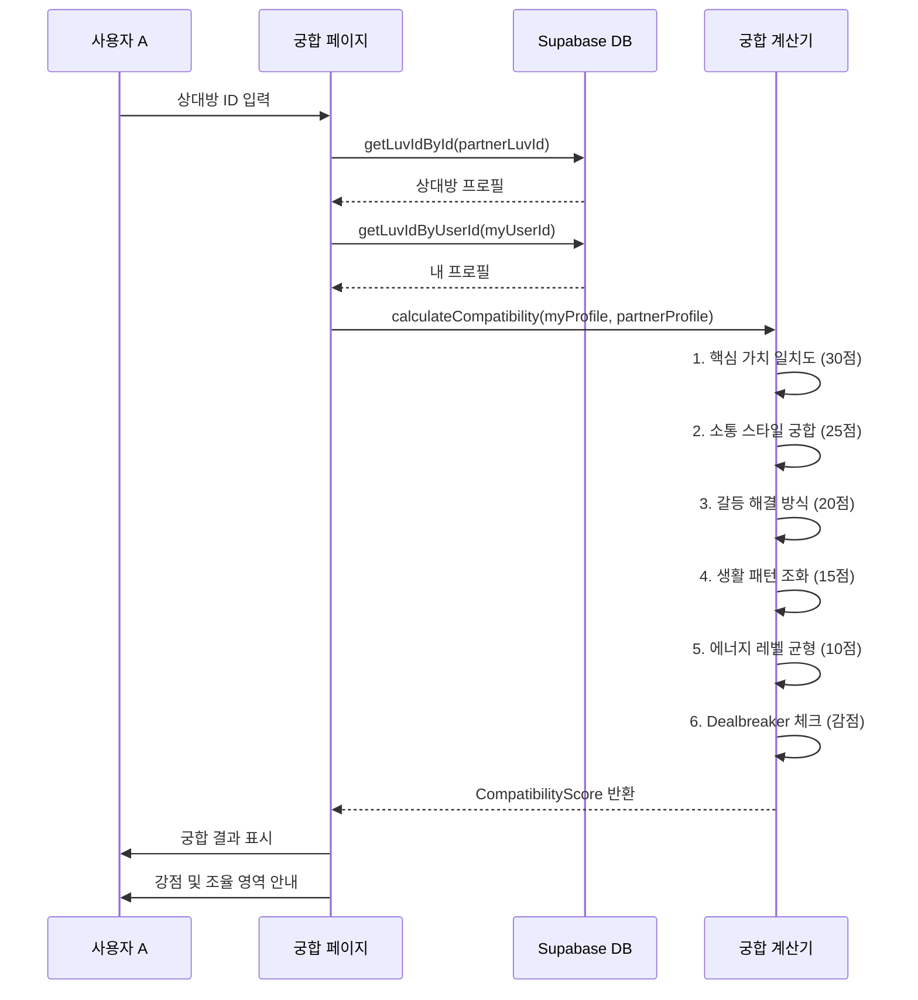

# Luv ID 시스템 아키텍처 문서

## 개요

Luv ID는 사용자의 "나 사용 설명서"를 기반으로 연애 프로필 카드를 생성하고, 다른 사용자와의 궁합을 분석하는 시스템입니다.

---

## 핵심 구성 요소

### 1. 데이터 모델 (`/src/features/luvid/model/`)

#### `types.ts` - 타입 정의

- **`LuvIdProfile`**: Luv ID 프로필 인터페이스

  - 기본 정보: ID, 닉네임, 태그라인
  - Identity: 아키타입, 테마 컬러
  - 핵심 지표: Top 3 가치, 연애 스타일, 에너지 레벨
  - 상세 분석: 소통 스타일, 갈등 대처, 위로 방식, 사과 선호
  - Dealbreakers: 절대 안 되는 것들

- **`CompatibilityScore`**: 궁합 점수 인터페이스

  - 총점 (0-100) 및 등급
  - 세부 점수: 가치(30), 소통(25), 갈등(20), 생활(15), 에너지(10)
  - 강점 및 조율 필요 영역
  - Dealbreaker 체크 결과

- **`CompatibilityGrade`**: 궁합 등급 (6단계)
  - perfect (🔥 90-100): 천생연분
  - great (💖 75-89): 찰떡궁합
  - good (💕 60-74): 좋은 인연
  - growth (💛 45-59): 성장 파트너
  - challenging (💙 30-44): 도전적 관계
  - friend (🤝 0-29): 친구 추천

#### `converter.ts` - 데이터 변환

- **`createLuvIdFromReport()`**: 나 사용 설명서 → Luv ID 프로필 변환
  - 자동 태그라인 생성 (아키타입 키워드 조합)
  - 에너지 레벨 계산 (독립성 vs 친밀감 선호도)
  - 모든 설명서 데이터 추출 및 구조화

#### `compatibility.ts` - 궁합 계산 엔진

- **`calculateCompatibility()`**: 두 프로필 간 궁합 분석
  - **핵심 가치 일치도 (30점)**: Top 3 가치 비교, 순위 가중치 적용
  - **소통 스타일 궁합 (25점)**: 의사소통 방식 호환성 분석
  - **갈등 해결 방식 (20점)**: 갈등 대처 스타일 조화도
  - **생활 패턴 조화 (15점)**: 위로 방식 및 일상 패턴 매칭
  - **에너지 레벨 균형 (10점)**: 독립성-친밀감 균형도
  - **Dealbreaker 체크**: 상대의 특성이 나의 지뢰밭인지 확인 (감점)

---

### 2. Supabase 서비스 (`/src/features/luvid/utils/`)

#### `supabase-service.ts`

- **`saveLuvId(profile)`**: Luv ID 저장
- **`getLuvIdByUserId(userId)`**: 사용자 ID로 조회
- **`getLuvIdById(id)`**: Luv ID로 조회
- **`checkLuvIdExists(userId)`**: 존재 여부 확인

#### 데이터베이스 스키마

```sql
CREATE TABLE luvid_profiles (
  id TEXT PRIMARY KEY,           -- Luv ID (예: LUV-A8F2E9)
  user_id TEXT NOT NULL,         -- 브라우저 user_id
  report_id TEXT NOT NULL,       -- 원본 설명서 ID
  data JSONB NOT NULL,           -- LuvIdProfile 전체 데이터
  created_at TIMESTAMP DEFAULT NOW(),
  updated_at TIMESTAMP DEFAULT NOW()
);

CREATE INDEX idx_luvid_user_id ON luvid_profiles(user_id);
```

---

### 3. UI 컴포넌트

#### 홈 화면 (`/src/app/page.tsx`)

**상태별 분기 렌더링:**

1. **로딩 중**: 스켈레톤 UI
2. **잠김** (설명서 없음): 자물쇠 아이콘, 비활성화
3. **발급 가능** (설명서 있음 + ID 없음): 핑크 그라데이션 카드, `/luvid/create` 링크
4. **활성화** (설명서 + ID 모두 있음): 홀로그램 스타일 카드, `/luvid/my` 링크

---

## 데이터 흐름

### 1. Luv ID 발급 플로우

```mermaid
sequenceDiagram
participant User as 사용자
participant Home as 홈 화면
participant Create as 발급 페이지
participant Converter as Converter
participant Supabase as Supabase DB

    User->>Home: 홈 접속
    Home->>Home: localStorage에서 설명서 확인
    Home->>Supabase: checkLuvIdExists(userId)
    Supabase-->>Home: false (ID 없음)
    Home->>User: "발급 가능" 카드 표시

    User->>Create: "Luv ID 발급하기" 클릭
    Create->>Create: 설명서 데이터 로드
    Create->>Converter: createLuvIdFromReport(report)
    Converter->>Converter: 태그라인 생성
    Converter->>Converter: 에너지 레벨 계산
    Converter-->>Create: LuvIdProfile 반환

    Create->>User: 미리보기 표시
    User->>Create: 확인 클릭
    Create->>Supabase: saveLuvId(profile)
    Supabase-->>Create: 저장 완료
    Create->>User: /luvid/my로 리다이렉트

```

### 2. 궁합 분석 플로우



### 3. 홈 화면 상태 확인 플로우

```mermaid
sequenceDiagram
participant User as 사용자
participant Home as 홈 화면
participant LocalStorage as localStorage
participant Supabase as Supabase DB

    User->>Home: 홈 접속
    Home->>Home: useEffect 실행

    Home->>LocalStorage: getItem('user_manual')
    LocalStorage-->>Home: 설명서 데이터 or null

    Home->>LocalStorage: getOrCreateUserId()
    LocalStorage-->>Home: userId

    Home->>Supabase: checkLuvIdExists(userId)
    Supabase->>Supabase: SELECT * FROM luvid_profiles WHERE user_id = ?
    Supabase-->>Home: true/false

    alt 설명서 없음
        Home->>User: 🔒 잠김 상태 카드
    else 설명서 있음 + ID 없음
        Home->>User: ✨ 발급 가능 카드
    else 설명서 + ID 모두 있음
        Home->>User: 💎 활성화 카드
    end

\`\`\`

---

## 주요 알고리즘

### 궁합 점수 계산 상세

#### 1. 핵심 가치 일치도 (30점)

\`\`\`typescript
// Top 3 가치 비교
// 같은 가치를 공유하면 점수, 순위가 비슷할수록 높은 점수
// 예: 둘 다 1순위가 "정직성" → 9점
// A의 1순위 = B의 3순위 → 3점
\`\`\`

#### 2. 소통 스타일 궁합 (25점)

- 같은 스타일: 25점
- 명확한 표현 + 명확한 표현: 24점
- 보완적 스타일: 20점
- 조율 필요: 15점

#### 3. 갈등 해결 방식 (20점)

- 해결형 + 해결형: 20점 (최고)
- 수용형 + 해결형: 18점 (균형)
- 수용형 + 수용형: 14점 (갈등 회피 위험)
- 회피형 포함: 10점 (소통 막힘 위험)

#### 4. Dealbreaker 체크

- 상대의 특성이 나의 dealbreaker와 충돌 시 각 5점 감점
- 예: "상처주는 농담"이 dealbreaker인데 상대가 유머 중시 → -5점

---

## 파일 구조

```

src/
├── features/
│ ├── luvid/
│ │ ├── model/
│ │ │ ├── types.ts # 타입 정의
│ │ │ ├── converter.ts # 설명서 → Luv ID 변환
│ │ │ └── compatibility.ts # 궁합 계산 엔진
│ │ ├── utils/
│ │ │ └── supabase-service.ts # DB CRUD
│ │ └── components/
│ │ └── (추후 구현)
│ └── user-manual/
│ └── (기존 설명서 기능)
└── app/
├── page.tsx # 홈 (상태 분기)
├── luvid/
│ ├── create/ # 발급 페이지
│ ├── my/ # 내 ID 보기
│ └── match/[id]/ # 궁합 보기
└── ...

```

---

## 환경 변수

```

NEXT_PUBLIC_SUPABASE_URL=your_supabase_url
NEXT_PUBLIC_SUPABASE_ANON_KEY=your_anon_key

```

---

## 다음 구현 단계

1. ✅ 데이터 모델 및 로직
2. ✅ 홈 화면 상태 분기
3. ⏳ Supabase 테이블 생성
4. ⏳ Luv ID 발급 페이지 (`/luvid/create`)
5. ⏳ 3D 카드 컴포넌트
6. ⏳ 내 ID 보기 페이지 (`/luvid/my`)
7. ⏳ 궁합 분석 페이지 (`/luvid/match/[id]`)
8. ⏳ QR 코드 공유 기능

```

```

```
